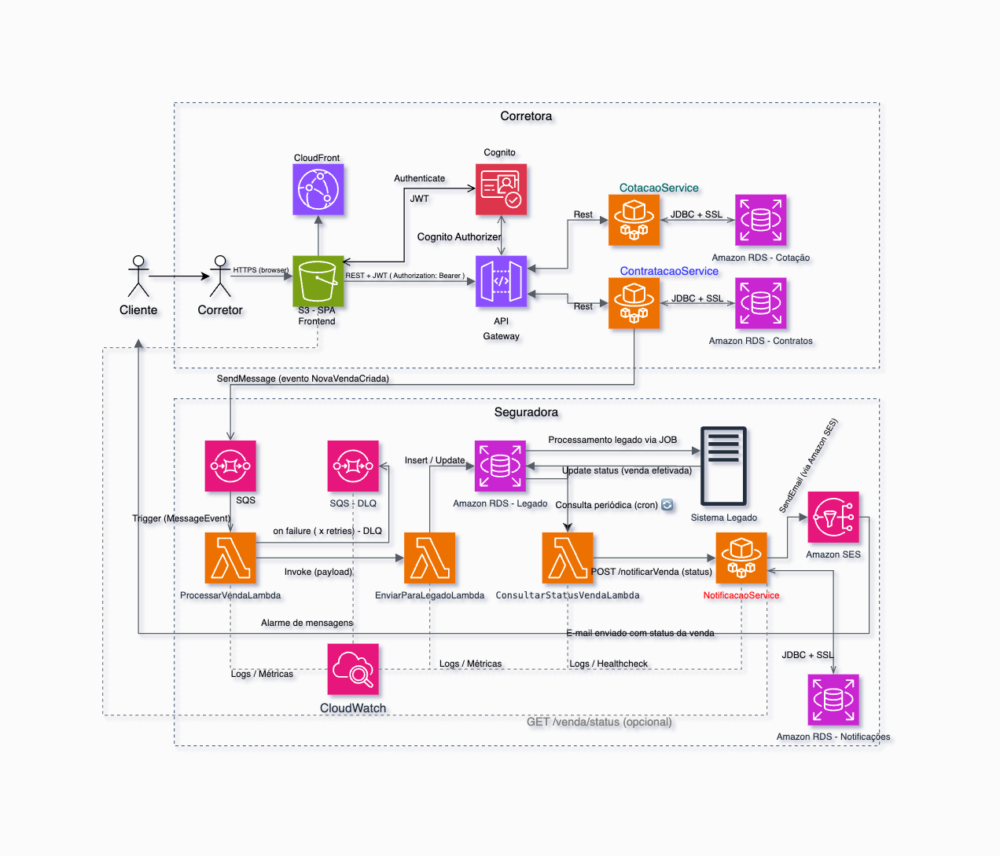

# 🧩 Arquitetura Geral – Jornada de Contratação de Seguros Automotivos

Este repositório documenta a arquitetura modernizada para a jornada de contratação de seguros automotivos, contemplando práticas modernas como **comunicação assíncrona**, **resiliência**, **integração com legado** e **Cloud-first**.

## 🚀 Visão Geral

A seguradora deseja modernizar a jornada de contratação, substituindo o modelo baseado em arquivos e processamento batch por uma solução **orientada a eventos**, **distribuída**, **resiliente**, com **monitoramento**, e **aderente aos princípios dos 12 Factors**. 

> ❗ O sistema legado da seguradora **não será modernizado**, sendo necessário garantir integração eficiente e segura entre as partes modernas e legadas.

---

## 🧱 Arquitetura da Solução

A arquitetura está dividida em **componentes modernizados** e **componentes legados**, conectados de forma assíncrona por meio de **fila SQS** e **AWS Lambda**.

### ✅ Padrões aplicados

- Clean Architecture e Hexagonal
- Princípios SOLID e DDD
- Separação por Domínio
- Princípios dos 12 Factors
- Comunicação assíncrona (SQS)
- Serverless (Lambda)
- FinOps-friendly
- Observabilidade e logs estruturados

---

## 🧩 Componentes Modernizados

### 🖥️ 1. Frontend (Angular)
- Interface de usuário para corretores e clientes.
- Se comunica via **API Gateway** com autenticação (Cognito Authorizer).
- Responsável por iniciar jornadas de **cotação** e **contratação**.

### 🌐 2. API Gateway + Cognito
- Roteia requisições HTTP para os microsserviços.
- Usa **Cognito Authorizer** para autenticar e validar tokens JWT.
- Permite autenticação transparente e escalável.

### 📦 3. CotacaoService
- Simula cotações de seguros com base no perfil, veículo e região.
- Possui banco próprio para persistir cotações.
- Retorna ID da cotação para prosseguir com a contratação.

### ⚙️ 4. ContratacaoService ([repositório separado](https://github.com/henriqueWitzel/contratacao-service))
- Responsável por receber uma solicitação de contratação.
- Persiste os dados no banco de dados.
- Publica o evento da nova venda na fila **SQS**.
- Implementado com arquitetura hexagonal, testes completos e observabilidade.

### 📬 5. AWS SQS – Fila de Eventos
- Garante **desacoplamento**, **resiliência** e **durabilidade** entre serviços modernos e legados.
- Permite reprocessamento e DLQ (dead-letter queue).

### 🧠 6. Lambda processarVendaLambda
- **Consome eventos da fila `nova-venda-criada`**.
- Realiza:
  - Validação de payloads
  - Transformação de dados
  - Reenvio para DLQ em caso de falha
- Chama a próxima Lambda (enviarParaLegadoLambda).

### 🏛️ 7. Lambda enviarParaLegadoLambda
- Realiza chamada REST ou escrita em banco legado intermediário.
- Permite que o **Sistema Legado da Seguradora** processe os dados como fazia anteriormente.
- Atende ao princípio de **convivência com o legado**.

### 🔄 8. Lambda consultarStatusVendaLambda
- Realiza **consulta periódica ou reativa** no banco legado para verificar status da venda.
- Se confirmada, envia dados ao serviço de notificação.

### 📧 9. NotificacaoService
- Envia e-mails para os clientes após confirmação de venda.
- Possui base de dados própria para controle de:
  - Tentativas
  - Sucesso/falha
  - Reenvios
- Futuramente pode expor **endpoint REST** para acompanhar status.

---

## 🏛️ Sistema Legado da Seguradora

- Banco legado é atualizado via Lambda.
- Processos batch e jobs continuam sendo executados como no modelo antigo.
- Não há alterações no sistema legado diretamente.

---

## 📂 Organização de Repositórios

| Componente             | Repositório                                            |
|------------------------|--------------------------------------------------------|
| contratacao-service    | [github.com/henriqueWitzel/contratacao-service](https://github.com/henriqueWitzel/contratacao-service) |
| Demais componentes     | Este repositório central contém documentação e visão arquitetural |

---

## 📐 Decisões Arquiteturais

- Separação clara de responsabilidades e domínios
- Adoção de arquitetura **modular e desacoplada**
- Uso de **Lambda functions** para integração com legado e lógica assíncrona
- **Event-driven** para garantir escalabilidade
- Foco em **observabilidade**, **resiliência** e **boas práticas de engenharia**

---

## 📌 Considerações Finais

- Esta arquitetura permite a modernização progressiva, garantindo entregas contínuas e integração confiável com sistemas legados.
- É possível adicionar novos microsserviços no futuro com mínimo impacto nos existentes.
- Segurança, testes, monitoramento e qualidade de código foram tratados como **requisitos de primeira classe**.

---

## 👤 Autor

**Henrique Witzel**  
Desenvolvedor backend e líder técnico com foco em:

- Arquitetura moderna
- Qualidade de código
- Boas práticas de engenharia de software

[LinkedIn](https://www.linkedin.com/in/henrique-witzel-2aa883149/)